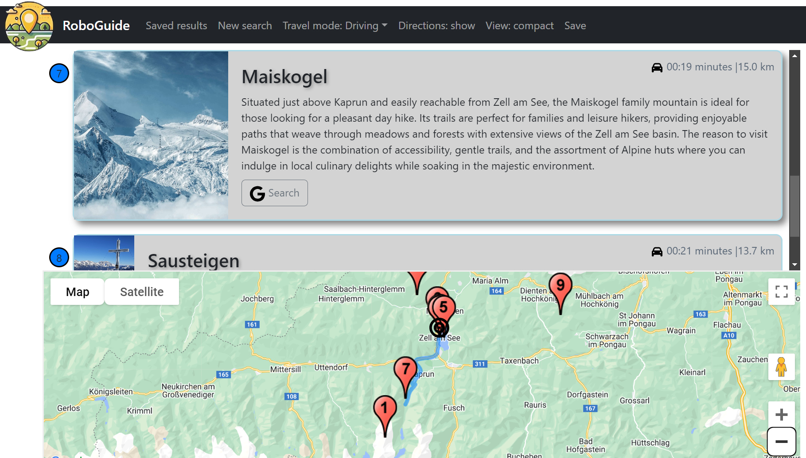

# RoboGuide Travel Recommendations

## Description

Search for travel recommendation near a specific location by the user's free text preferences. The project uses OpenAI API to get structured recommendations from the ChatGPT-4 model, convert them to geolocation and display on a map together with related distances, directions and images extracted using Google's places API and a web scraping engine.

## Usage

Add an OpenAI API key and a Google Maps API key to the relevant .env files.
Build Docker containers using the command "docker compose build"

## Live Version

Available at [https://recommend.roboguide.xyz](https://recommend.roboguide.xyz)

## Screenshot

## License

This project is licensed under the GNU General Public License (GPL). See the [LICENSE](LICENSE) file for details.
